# Steps to Start Using Aggregata: GPT to Earn 
Aggregata is built for seamless data flow in the AI world. With Aggregata: GPT to Earn Chrome extension, you can contribute your conversations with ChatGPT to model trainers and earn attractive rewards.

This tutorial aims to guide you through our dApp in a step-by-step manner. 

Friendly Reminder: 
You'll need to create accounts on [ChatGPT](https://chat.openai.com/) and [MetaMask](https://metamask.io/) to use Aggregata: GPT to Earn. 
If you plan on uploading conversations with ChatGPT, you will also need to transfer $BNB from BNB Chain to BNB Greenfield on [Dcellar](https://greenfield.bnbchain.org/en/bridge?type=transfer-in).

Aggregata: GPT to Earn extension supports Chrome version 101 or above. For the extension to work properly, it would be best to update Chrome to the latest version.

## Downloading Aggregata: GPT to Earn Chrome extension
**Step 1:** Download our Chrome extension.

**Step 2:** Unzip the downloaded file.

**Step 3:** Go to chrome://extensions/ and select Load unpacked. Then upload the folder.

  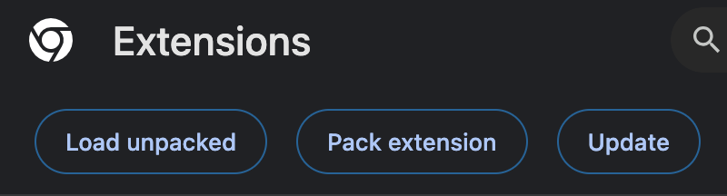

**Step 4:** You can find Aggregata: GPT to Earn in Chrome Extensions now.

  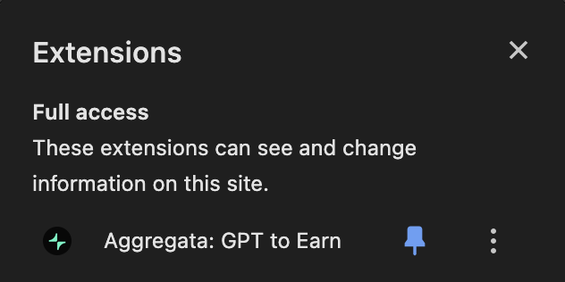

## Login Aggregata: GPT to Earn
To log in, follow these steps:

**Step 1:** Log in to [ChatGPT](https://chat.openai.com/), you can find the Aggregata logo on the right side. Click `Connect Wallet`. 

  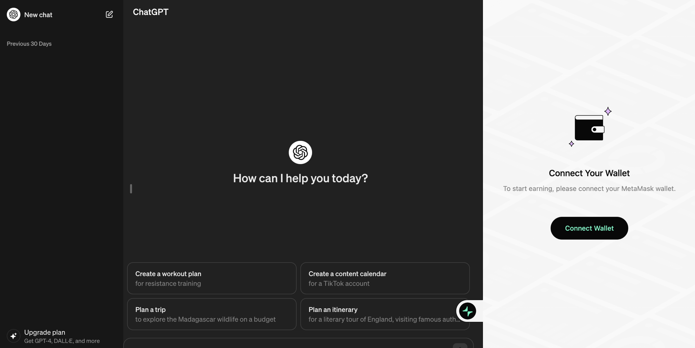

**Step 2:** Click Next on the Connect with MetaMask page, and then click `Connect` on the second page.

  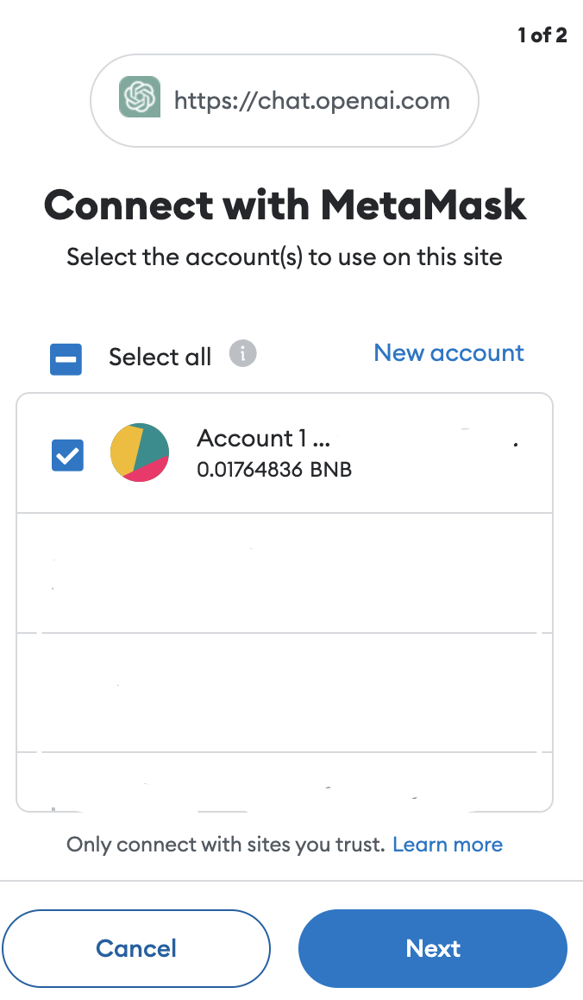

  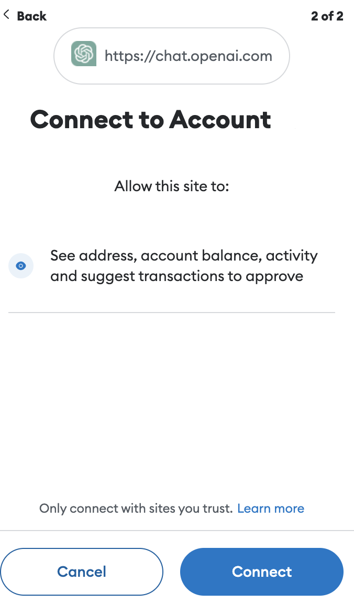

Click `Sign` on the Signature request page.

  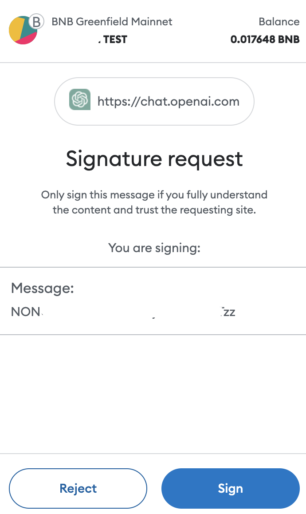

**Step 3:** When the right-hand sidebar appears like this, it means that you have successfully logged in.

  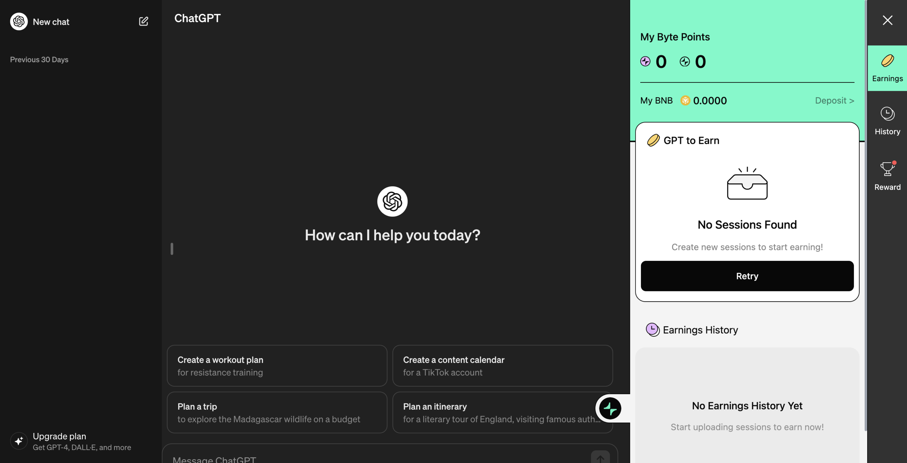

## Using GPT to Earn and get your points
**Step 1:** Create a conversation with ChatGPT. 

  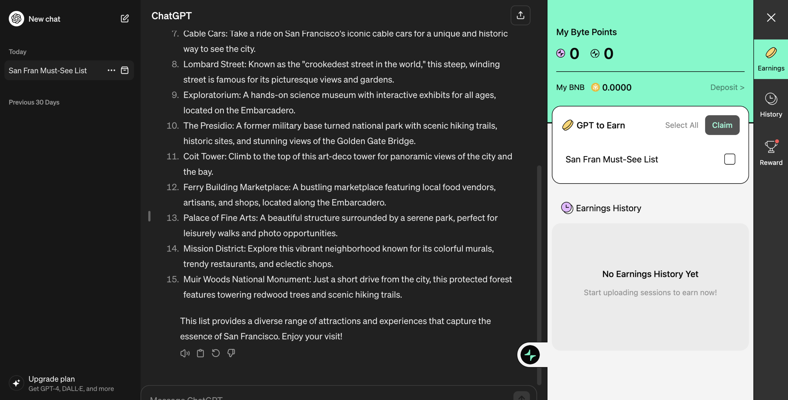

**Step 2:** Select the conversation, click Claim, then Sign in MetaMask Signature request page. Then the session will be uploaded.

Currently, **only 1 session** can be claimed at a time.

  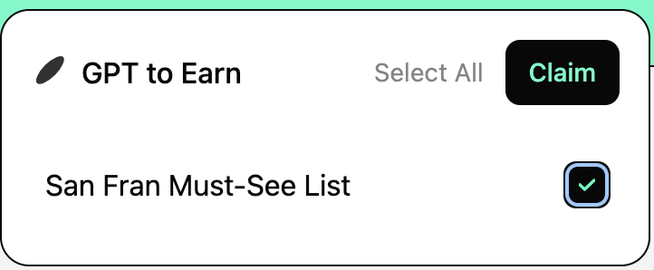

  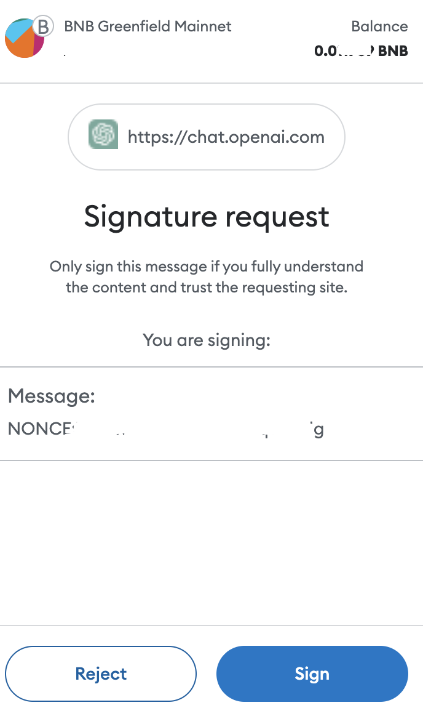

**Step 3:** After uploading the session successfully, you can check your earned points in My Byte Points.  Points are calculated separately for sessions generated by GPT-3.5 and GPT-4. The calculation is based on the uniqueness of your conversation.

  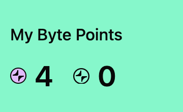

