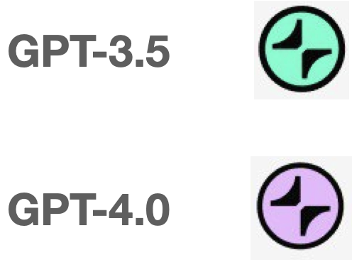

# Aggregata Points
In Aggregata: GPT to Earn, you can earn points through using ChatGPT.

## Using ChatGPT
Points are calculated separately for sessions generated by GPT-3.5 and GPT-4. 

  

The more unique and innovative your conversations, the more points you will get. Repetitive sessions, including those you've previously submitted yourself and comparable ones submitted by other users, are likely to receive 0 points.
