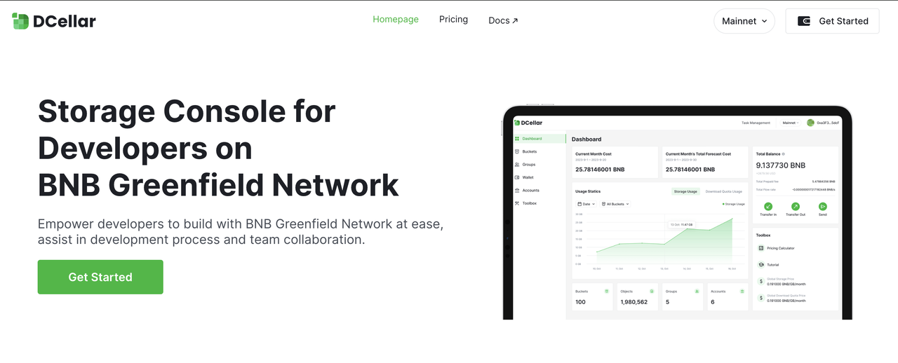
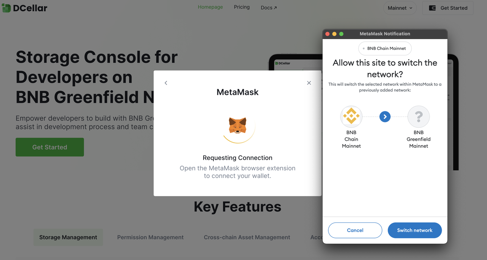
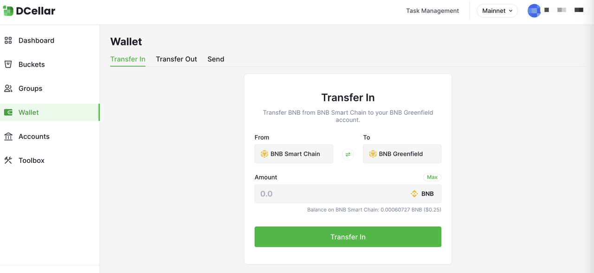
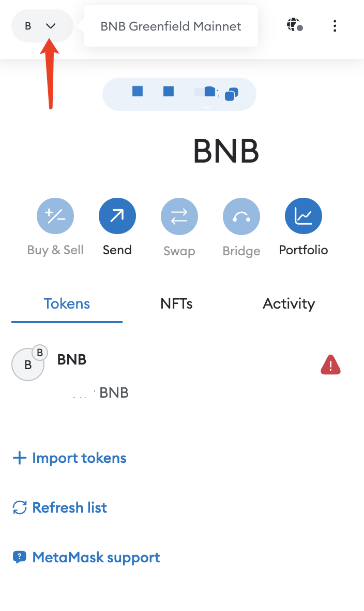
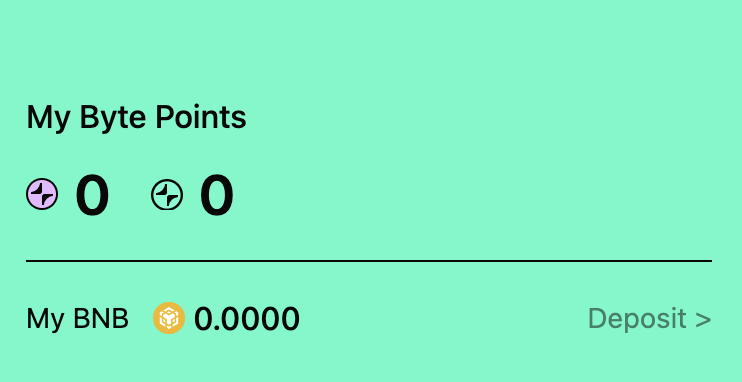

# Transfer BNB to BNB Greenfield on Dcellar
Before using Aggregata: GPT to Earn, it is important that you have a [MetaMask](https://metamask.io/) account, as a wallet is necessary to connect to Aggregata. Since Aggregata is built on BNB Greenfield,  BNB and BSC are adopted for transactions. Therefore, you need to have BNB in your wallet to cover possible transaction fees. The transaction fee is 0.0001 BNB for every claimed session.

## Connect your wallet to Dcellar
Dcellar is an official WebAPP of BNB, serving as a storage console on BNB Greenfield Network. You will need it to transfer BNB from the BNB Chain to the BNB Greenfield account
- Enter Dcellar https://dcellar.io/ 
- Click `GetStarted`

  

- Select and connect your wallet. In this tutorial we choose MetaMask.
- Click Switch network and allow DCellar switch network.

  

## Transfer BNB to BNB Greenfield
- Click `Wallet` on the left bar.
- Enter the amount you want to transfer to BNB Greenfield.
- Click `Transfer in`
- Sign the Signature Request in MetaMask

  

After the transfer is complete, select the network BNB Greenfield Mainnet on MetaMask to view your BNB in the wallet.

  

If you are already connected to the Decellar.

Click `Deposit` on Aggregata: GPT to Earn. You will be directly linked to the 'Transfer-in' page on Decellar, follow the steps above to complete the transaction. 

  

